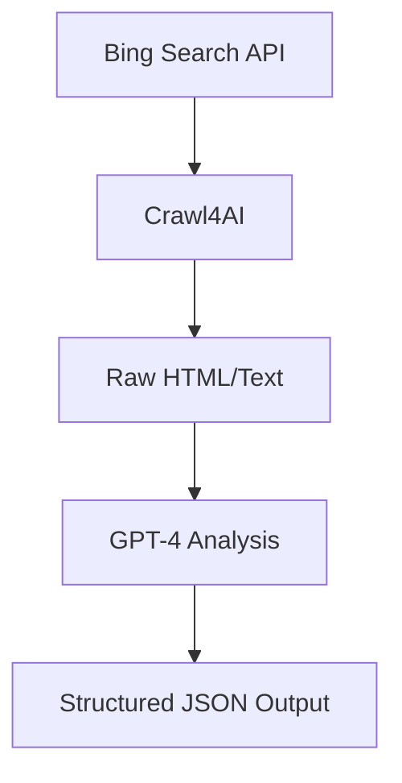

# LLMkpiHunter 
 
Smart KPI Extraction from FMCG Reports Using Bing Search, Crawl4AI, and GPT-4

## 🚀 Project Overview
**KPIHawk-AI** is an intelligent system that:
1. **Searches** FMCG reports and documents from multiple countries using **Bing Search API**.
2. **Scrapes** relevant webpages and documents using **Crawl4AI**.
3. **Extracts** structured KPI data using **GPT-4**, guided by a predefined KPI framework.

This pipeline helps automate insights collection for FMCG industry analysis across different regions.

---

## 🧠 Tech Stack

- 🔍 **Bing Search API** – for discovering relevant report links  
- 🕸️ **Crawl4AI** – to scrape unstructured data from URLs  
- 🤖 **OpenAI GPT-4** – for semantic analysis and KPI extraction  
- 🐍 **Python** – for building and integrating the pipeline  
- 📁 **JSON** – to store structured KPI outputs  

---

## 📊 Target KPIs

- Total Sales  
- Channel Performance  
- Promotion Impact  
- Market Share  
- Customer Retention  
- Average Selling Price (ASP)  
- Product Demand  
- Dealer Stock  
- Brand-wise Sales  
- Cost Optimization

---

## 🧪 How It Works


## How to run 
run get_links.py -> then main.py
# CSV Processing Project

## ✅ How to Run This Project

### 1. Clone the Repository
```bash
git clone <your-repo-url>
cd <project-folder> 

## Manually Create the Following Folders (Required)

cleaned_category
filtered_exports
Final_Data
